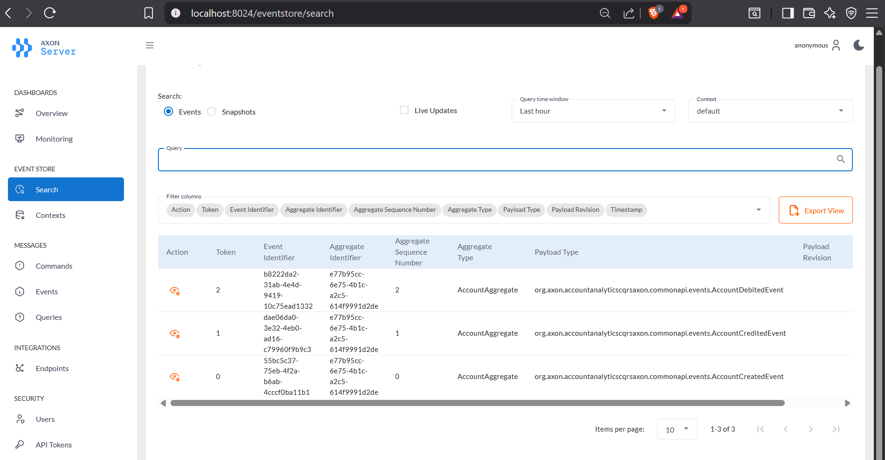
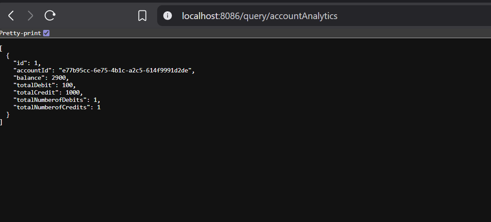
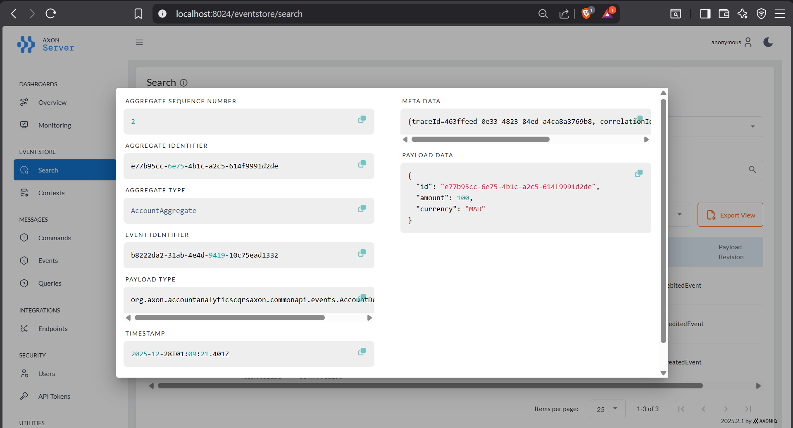
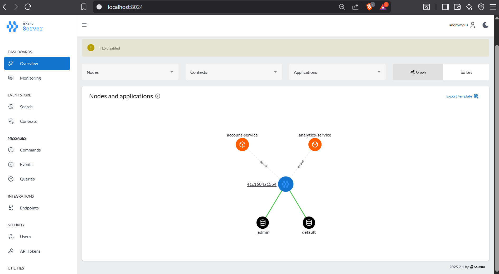
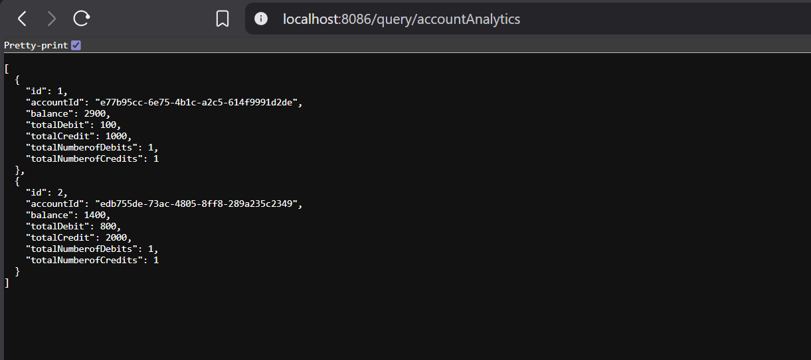
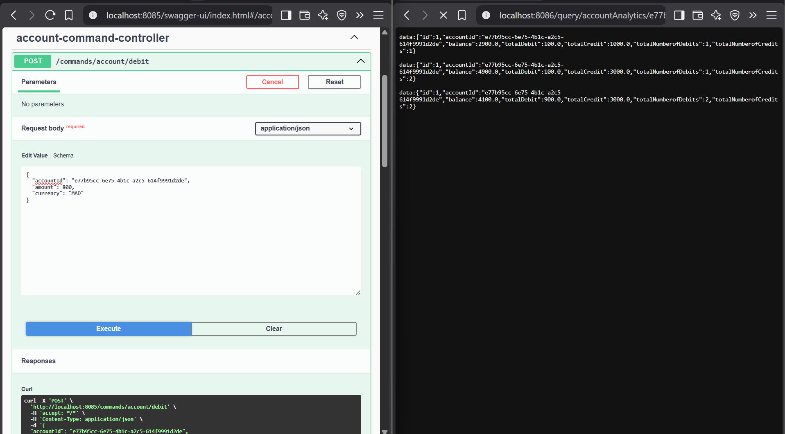

# Account Analytics - Microservices avec Event Sourcing, CQRS et Axon Framework

## Description du Projet

Ce projet est une application complète de gestion et d'analyse de comptes bancaires, construite avec une architecture microservices moderne. L'application utilise les patterns Event Sourcing et CQRS (Command Query Responsibility Segregation) via Axon Framework pour garantir une traçabilité complète des opérations bancaires et une séparation optimale entre les opérations de lecture et d'écriture.

Le système permet de créer des comptes bancaires, d'effectuer des opérations de crédit et de débit, de consulter l'historique complet des transactions, et de visualiser des analyses détaillées via un tableau de bord interactif.


## Architecture Technique

### Patterns Architecturaux Implémentés

**Event Sourcing**
- Stockage de tous les événements dans un Event Store
- Reconstruction de l'état actuel à partir de l'historique des événements
- Traçabilité complète et immuable de toutes les opérations
- Possibilité de replay et d'audit complet

**CQRS (Command Query Responsibility Segregation)**
- Séparation stricte entre les commandes (write model) et les requêtes (read model)
- Optimisation indépendante des opérations de lecture et d'écriture
- Modèles de données adaptés à chaque type d'opération
- Scalabilité horizontale facilitée

**Architecture Microservices**
- Services indépendants et déployables séparément
- Communication asynchrone via événements
- Couplage faible entre les services
- Résilience et isolation des pannes

**Event-Driven Architecture**
- Communication basée sur les événements
- Réactivité en temps réel
- Découplage des composants
- Extensibilité facilitée

### Stack Technologique

**Backend**
- Java 11+ / Spring Boot 2.x
- Axon Framework 4.x (Event Sourcing & CQRS)
- Spring Data JPA (persistance des données)
- MySQL 8.0 (base de données relationnelle)
- Maven (gestion des dépendances)
- Lombok (réduction du code boilerplate)
- Spring Web (API REST)

**Frontend**
- Angular 12+
- TypeScript
- Bootstrap 4/5 (design responsive)
- Chart.js / Recharts (visualisations graphiques)
- RxJS (programmation réactive)

**Infrastructure & Outils**
- Axon Server (Event Store & Message Router)
- Postman (tests API)
- MySQL Workbench (gestion base de données)

## Structure du Projet

```
account-analytics/
│
├── account-command-side/              # Service de gestion des commandes
│   ├── src/main/java/
│   │   ├── commands/                  # Définition des commandes
│   │   │   ├── CreateAccountCommand
│   │   │   ├── CreditAccountCommand
│   │   │   └── DebitAccountCommand
│   │   ├── aggregates/                # Agrégats Axon
│   │   │   └── AccountAggregate
│   │   ├── events/                    # Événements métier
│   │   │   ├── AccountCreatedEvent
│   │   │   ├── AccountCreditedEvent
│   │   │   └── AccountDebitedEvent
│   │   ├── controllers/               # API REST pour les commandes
│   │   │   └── AccountCommandController
│   │   └── services/                  # Services métier
│   └── resources/
│       └── application.properties
│
├── account-query-side/                # Service de gestion des requêtes
│   ├── src/main/java/
│   │   ├── entities/                  # Entités JPA
│   │   │   ├── Account
│   │   │   └── Operation
│   │   ├── repositories/              # Repositories Spring Data
│   │   │   ├── AccountRepository
│   │   │   └── OperationRepository
│   │   ├── controllers/               # API REST pour les requêtes
│   │   │   └── AccountQueryController
│   │   ├── services/                  # Services de projection
│   │   │   └── AccountEventHandler
│   │   └── dto/                       # Data Transfer Objects
│   └── resources/
│       └── application.properties
│
├── account-common-api/                # API partagée entre services
│   └── src/main/java/
│       ├── commands/                  # DTOs de commandes
│       ├── events/                    # DTOs d'événements
│       ├── queries/                   # DTOs de requêtes
│       └── enums/                     # Énumérations
│           ├── AccountStatus
│           └── OperationType
│
├── analytics-dashboard/               # Application frontend Angular
│   ├── src/
│   │   ├── app/
│   │   │   ├── components/
│   │   │   │   ├── account-list/
│   │   │   │   ├── account-details/
│   │   │   │   ├── operations-list/
│   │   │   │   ├── analytics-chart/
│   │   │   │   └── operation-form/
│   │   │   ├── services/
│   │   │   │   ├── account.service.ts
│   │   │   │   └── operation.service.ts
│   │   │   ├── models/
│   │   │   └── app-routing.module.ts
│   │   └── assets/
│   └── package.json
│
└── axon-server/                       # Configuration Axon Server
    └── config/
        └── axonserver.properties
```

## Fonctionnalités Détaillées

### 1. Gestion des Comptes (Command Side)

**Création de Compte**
- Génération automatique ou manuelle de l'identifiant du compte
- Définition du solde initial
- Sélection de la devise (EUR, USD, MAD, etc.)
- Validation des données avant création
- Émission d'un événement AccountCreatedEvent

**Opérations de Crédit**
- Ajout de fonds au compte
- Validation du montant (positif et non nul)
- Mise à jour du solde
- Enregistrement de l'opération dans l'historique
- Émission d'un événement AccountCreditedEvent

**Opérations de Débit**
- Retrait de fonds du compte
- Vérification du solde disponible
- Protection contre les découverts non autorisés
- Mise à jour du solde
- Émission d'un événement AccountDebitedEvent

### 2. Consultation des Données (Query Side)

**Vue des Comptes**
- Liste de tous les comptes avec pagination
- Filtrage par statut, devise ou solde
- Recherche par identifiant de compte
- Affichage du solde actuel et de la devise

**Historique des Opérations**
- Liste chronologique de toutes les transactions
- Filtrage par type (crédit/débit)
- Filtrage par période (date de début/fin)
- Affichage des détails : date, type, montant, description
- Export des données (CSV, PDF)

**Détails du Compte**
- Informations complètes du compte
- Solde actuel en temps réel
- Date de création
- Statut du compte (actif, suspendu, fermé)
- Statistiques : nombre d'opérations, total des crédits/débits

### 3. Tableau de Bord Analytique (Analytics Dashboard)

**Graphiques de Tendances**
- Évolution du solde dans le temps (graphique linéaire)
- Comparaison crédits vs débits (graphique en barres)
- Distribution des opérations par type (graphique circulaire)
- Analyse mensuelle des flux financiers

**Statistiques en Temps Réel**
- Solde total de tous les comptes
- Nombre total d'opérations
- Montant total des crédits
- Montant total des débits
- Solde moyen par compte

**Visualisations Interactives**
- Graphiques réactifs avec zoom et filtrage
- Sélection de périodes personnalisées
- Affichage des détails au survol
- Export des graphiques (PNG, SVG)

**Tableau de Bord Personnalisable**
- Organisation des widgets par glisser-déposer
- Sélection des métriques à afficher
- Rafraîchissement automatique des données
- Thème clair/sombre

### 4. Event Store et Axon Server

**Stockage des Événements**
- Persistance immuable de tous les événements
- Ordre chronologique garanti
- Métadonnées associées (timestamp, agrégat ID, version)
- Possibilité de replay complet

**Interface de Monitoring Axon**
- Visualisation des événements en temps réel
- Exploration de l'Event Store
- Statistiques sur les commandes traitées
- Monitoring des agrégats actifs
- Debugging du flux d'événements

**Gestion des Snapshots**
- Création automatique de snapshots pour optimiser les performances
- Réduction du temps de chargement des agrégats
- Configuration du seuil de déclenchement

### 5. Base de Données (Query Side)

**Structure des Tables**

Table: `accounts`
- id (VARCHAR) - Primary Key
- balance (DECIMAL)
- currency (VARCHAR)
- status (VARCHAR)
- created_date (TIMESTAMP)
- updated_date (TIMESTAMP)

Table: `operations`
- id (BIGINT) - Primary Key, Auto-increment
- operation_date (TIMESTAMP)
- type (VARCHAR) - CREDIT ou DEBIT
- amount (DECIMAL)
- description (VARCHAR)
- account_id (VARCHAR) - Foreign Key vers accounts

**Consultation en Direct**
- Visualisation des données en temps réel
- Exécution de requêtes SQL personnalisées
- Vérification de la cohérence des données
- Analyse des performances des requêtes

## Installation et Configuration Détaillées

### Prérequis Système

- **Java Development Kit (JDK)**: Version 11 ou supérieure
- **Maven**: Version 3.6+ pour la gestion des dépendances
- **Node.js**: Version 14+ et npm pour le frontend Angular
- **MySQL**: Version 8.0+ pour la base de données
- **Axon Server**: Version 4.5+ (téléchargeable depuis axoniq.io)
- **Git**: Pour cloner le repository
- **Postman**: Pour tester les endpoints API (optionnel)

### Configuration de l'Environnement

#### 1. Installation de MySQL

```bash
# Installation sur Ubuntu/Debian
sudo apt update
sudo apt install mysql-server

# Démarrer le service MySQL
sudo systemctl start mysql
sudo systemctl enable mysql

# Sécuriser l'installation
sudo mysql_secure_installation
```

#### 2. Création de la Base de Données

```sql
-- Se connecter à MySQL
mysql -u root -p

-- Créer la base de données
CREATE DATABASE account_analytics_db CHARACTER SET utf8mb4 COLLATE utf8mb4_unicode_ci;

-- Créer un utilisateur dédié
CREATE USER 'account_user'@'localhost' IDENTIFIED BY 'votre_mot_de_passe_securise';

-- Accorder les privilèges
GRANT ALL PRIVILEGES ON account_analytics_db.* TO 'account_user'@'localhost';
FLUSH PRIVILEGES;

-- Vérifier la création
SHOW DATABASES;
USE account_analytics_db;
```

#### 3. Configuration du Command Side

Fichier: `account-command-side/src/main/resources/application.properties`

```properties
# Configuration du serveur
server.port=8081
spring.application.name=account-command-side

# Configuration Axon
axon.axonserver.servers=localhost:8124

# Configuration JPA (optionnel pour le command side)
spring.jpa.hibernate.ddl-auto=update
spring.jpa.show-sql=true
spring.jpa.properties.hibernate.format_sql=true

# Configuration des logs
logging.level.org.axonframework=DEBUG
logging.level.com.example=DEBUG
```

#### 4. Configuration du Query Side

Fichier: `account-query-side/src/main/resources/application.properties`

```properties
# Configuration du serveur
server.port=8082
spring.application.name=account-query-side

# Configuration Axon
axon.axonserver.servers=localhost:8124

# Configuration de la base de données MySQL
spring.datasource.url=jdbc:mysql://localhost:3306/account_analytics_db?useSSL=false&serverTimezone=UTC
spring.datasource.username=account_user
spring.datasource.password=votre_mot_de_passe_securise
spring.datasource.driver-class-name=com.mysql.cj.jdbc.Driver

# Configuration JPA
spring.jpa.hibernate.ddl-auto=update
spring.jpa.show-sql=true
spring.jpa.properties.hibernate.dialect=org.hibernate.dialect.MySQL8Dialect
spring.jpa.properties.hibernate.format_sql=true

# Configuration du pool de connexions
spring.datasource.hikari.maximum-pool-size=10
spring.datasource.hikari.minimum-idle=5

# Configuration des logs
logging.level.org.springframework.web=DEBUG
logging.level.org.hibernate.SQL=DEBUG
logging.level.org.hibernate.type.descriptor.sql.BasicBinder=TRACE
```

#### 5. Configuration du Frontend Angular

Fichier: `analytics-dashboard/src/environments/environment.ts`

```typescript
export const environment = {
  production: false,
  apiCommandUrl: 'http://localhost:8081',
  apiQueryUrl: 'http://localhost:8082',
  refreshInterval: 5000 // Rafraîchissement toutes les 5 secondes
};
```

### Procédure d'Installation Complète

#### Étape 1: Cloner le Repository

```bash
git clone https://github.com/malakzaidi/Account-Analytics-microservices-event-sourcing-cqrs-axon-app-p2-ZAIDI-Malak.git

cd Account-Analytics-microservices-event-sourcing-cqrs-axon-app-p2-ZAIDI-Malak
```

#### Étape 2: Démarrer Axon Server

```bash
# Télécharger Axon Server
wget https://download.axoniq.io/axonserver/AxonServer.zip

# Décompresser
unzip AxonServer.zip
cd AxonServer

# Démarrer Axon Server
java -jar axonserver.jar

# Axon Server sera accessible sur:
# - Interface Web: http://localhost:8024
# - gRPC: localhost:8124
```

Vérifier le démarrage en accédant à `http://localhost:8024` - vous devriez voir l'interface de monitoring Axon Server.

#### Étape 3: Compiler et Démarrer le Command Side

```bash
# Naviguer vers le module command side
cd account-command-side

# Compiler le projet
mvn clean install

# Démarrer l'application
mvn spring-boot:run

# Vérifier que le service est démarré
curl http://localhost:8081/actuator/health
```

Le service devrait se connecter automatiquement à Axon Server. Vérifier les logs pour confirmer la connexion.

#### Étape 4: Compiler et Démarrer le Query Side

```bash
# Dans un nouveau terminal, naviguer vers le module query side
cd account-query-side

# Compiler le projet
mvn clean install

# Démarrer l'application
mvn spring-boot:run

# Vérifier que le service est démarré
curl http://localhost:8082/actuator/health
```

Vérifier dans MySQL que les tables ont été créées automatiquement:

```sql
USE account_analytics_db;
SHOW TABLES;
DESCRIBE accounts;
DESCRIBE operations;
```

#### Étape 5: Installer et Démarrer le Frontend

```bash
# Naviguer vers le dossier frontend
cd analytics-dashboard

# Installer les dépendances
npm install

# Démarrer le serveur de développement
ng serve --open

# Ou avec une configuration spécifique
ng serve --host 0.0.0.0 --port 4200
```

L'application s'ouvrira automatiquement dans votre navigateur à l'adresse `http://localhost:4200`

## Utilisation de l'Application

### 1. Création d'un Compte

**Via Postman (API)**

```http
POST http://localhost:8081/commands/accounts/create
Content-Type: application/json

{
  "accountId": "ACC-001",
  "initialBalance": 5000.00,
  "currency": "MAD"
}
```

**Réponse attendue:**

```json
{
  "id": "ACC-001",
  "status": "CREATED",
  "message": "Account created successfully"
}
```

**Via l'Interface Web**
1. Cliquer sur "Nouveau Compte"
2. Remplir le formulaire:
   - ID du compte (ou laisser générer automatiquement)
   - Solde initial
   - Devise
3. Cliquer sur "Créer"
4. Confirmation affichée avec redirection vers les détails du compte

### 2. Opération de Crédit

**Via Postman (API)**

```http
POST http://localhost:8081/commands/accounts/ACC-001/credit
Content-Type: application/json

{
  "amount": 1500.00,
  "description": "Dépôt de salaire"
}
```

**Réponse attendue:**

```json
{
  "accountId": "ACC-001",
  "operationType": "CREDIT",
  "amount": 1500.00,
  "newBalance": 6500.00,
  "timestamp": "2025-12-28T10:30:00Z"
}
```

**Via l'Interface Web**
1. Sélectionner le compte
2. Cliquer sur "Crédit"
3. Saisir le montant et la description
4. Confirmer l'opération
5. Le solde se met à jour en temps réel

### 3. Opération de Débit

**Via Postman (API)**

```http
POST http://localhost:8081/commands/accounts/ACC-001/debit
Content-Type: application/json

{
  "amount": 500.00,
  "description": "Retrait DAB"
}
```

**Réponse attendue:**

```json
{
  "accountId": "ACC-001",
  "operationType": "DEBIT",
  "amount": 500.00,
  "newBalance": 6000.00,
  "timestamp": "2025-12-28T11:00:00Z"
}
```

**Gestion des Erreurs:**

Si le solde est insuffisant:

```json
{
  "error": "INSUFFICIENT_BALANCE",
  "message": "Le solde disponible (6000.00 MAD) est insuffisant pour effectuer un débit de 7000.00 MAD",
  "accountId": "ACC-001",
  "currentBalance": 6000.00,
  "requestedAmount": 7000.00
}
```

### 4. Consultation des Comptes

**Via API - Liste de tous les comptes**

```http
GET http://localhost:8082/query/accounts
```

**Réponse:**

```json
[
  {
    "id": "ACC-001",
    "balance": 6000.00,
    "currency": "MAD",
    "status": "ACTIVE",
    "createdDate": "2025-12-28T09:00:00Z",
    "operationsCount": 3
  },
  {
    "id": "ACC-002",
    "balance": 15000.00,
    "currency": "EUR",
    "status": "ACTIVE",
    "createdDate": "2025-12-28T10:00:00Z",
    "operationsCount": 5
  }
]
```

**Via API - Détails d'un compte spécifique**

```http
GET http://localhost:8082/query/accounts/ACC-001
```

**Via API - Historique des opérations**

```http
GET http://localhost:8082/query/accounts/ACC-001/operations
```

**Réponse:**

```json
{
  "accountId": "ACC-001",
  "operations": [
    {
      "id": 1,
      "date": "2025-12-28T09:00:00Z",
      "type": "CREDIT",
      "amount": 5000.00,
      "description": "Solde initial"
    },
    {
      "id": 2,
      "date": "2025-12-28T10:30:00Z",
      "type": "CREDIT",
      "amount": 1500.00,
      "description": "Dépôt de salaire"
    },
    {
      "id": 3,
      "date": "2025-12-28T11:00:00Z",
      "type": "DEBIT",
      "amount": 500.00,
      "description": "Retrait DAB"
    }
  ],
  "totalOperations": 3,
  "totalCredits": 6500.00,
  "totalDebits": 500.00,
  "currentBalance": 6000.00
}
```

### 5. Utilisation du Tableau de Bord Analytique

**Accès au Dashboard**
- Naviguer vers `http://localhost:4200/dashboard`

**Fonctionnalités disponibles:**

**Graphique d'Évolution du Solde**
- Affiche l'évolution du solde dans le temps
- Filtrage par période (jour, semaine, mois, année)
- Zoom interactif sur une période spécifique
- Affichage des détails au survol

**Graphique Crédits vs Débits**
- Comparaison visuelle des crédits et débits
- Regroupement par jour/semaine/mois
- Identification rapide des tendances
- Export en image

**Statistiques Globales**
- Cartes affichant les métriques clés:
  - Solde total
  - Nombre d'opérations
  - Total des crédits
  - Total des débits
  - Solde moyen

**Tableau des Opérations Récentes**
- Liste des dernières transactions
- Tri par date, montant, type
- Recherche par description
- Pagination

### 6. Consultation de l'Event Store via Axon Server

**Accès à l'Interface Axon**
- Naviguer vers `http://localhost:8024`

**Visualisation des Événements**
1. Cliquer sur "Search" dans le menu
2. Entrer l'identifiant de l'agrégat (ex: ACC-001)
3. Visualiser la liste chronologique des événements:
   - AccountCreatedEvent
   - AccountCreditedEvent
   - AccountDebitedEvent

**Exemple de visualisation d'événement:**

```json
{
  "aggregateIdentifier": "ACC-001",
  "sequenceNumber": 0,
  "type": "AccountCreatedEvent",
  "timestamp": "2025-12-28T09:00:00.000Z",
  "payloadType": "com.example.events.AccountCreatedEvent",
  "payload": {
    "accountId": "ACC-001",
    "initialBalance": 5000.00,
    "currency": "MAD"
  },
  "metaData": {
    "traceId": "...",
    "correlationId": "..."
  }
}
```

**Replay des Événements**
- Possibilité de rejouer tous les événements d'un agrégat
- Reconstruction de l'état actuel
- Utile pour le debugging et l'audit

### 7. Consultation Directe de la Base de Données

**Connexion à MySQL**

```bash
mysql -u account_user -p account_analytics_db
```

**Requêtes Utiles**

```sql
-- Voir tous les comptes
SELECT * FROM accounts;

-- Voir les opérations d'un compte spécifique
SELECT * FROM operations WHERE account_id = 'ACC-001' ORDER BY operation_date DESC;

-- Statistiques par compte
SELECT 
    a.id,
    a.balance,
    COUNT(o.id) as total_operations,
    SUM(CASE WHEN o.type = 'CREDIT' THEN o.amount ELSE 0 END) as total_credits,
    SUM(CASE WHEN o.type = 'DEBIT' THEN o.amount ELSE 0 END) as total_debits
FROM accounts a
LEFT JOIN operations o ON a.id = o.account_id
GROUP BY a.id, a.balance;

-- Dernières opérations
SELECT 
    o.operation_date,
    o.type,
    o.amount,
    o.description,
    a.id as account_id,
    a.balance as current_balance
FROM operations o
JOIN accounts a ON o.account_id = a.id
ORDER BY o.operation_date DESC
LIMIT 10;
```

**Vérification de la Cohérence des Données**

```sql
-- Vérifier que le solde calculé correspond au solde enregistré
SELECT 
    a.id,
    a.balance as recorded_balance,
    (COALESCE(SUM(CASE WHEN o.type = 'CREDIT' THEN o.amount ELSE 0 END), 0) - 
     COALESCE(SUM(CASE WHEN o.type = 'DEBIT' THEN o.amount ELSE 0 END), 0)) as calculated_balance,
    (a.balance - (COALESCE(SUM(CASE WHEN o.type = 'CREDIT' THEN o.amount ELSE 0 END), 0) - 
     COALESCE(SUM(CASE WHEN o.type = 'DEBIT' THEN o.amount ELSE 0 END), 0))) as difference
FROM accounts a
LEFT JOIN operations o ON a.id = o.account_id
GROUP BY a.id, a.balance;
```

## Tests des Endpoints - Collection Postman

### Configuration de Postman

**Importer la Collection**
1. Ouvrir Postman
2. Cliquer sur "Import"
3. Importer le fichier `Account-Analytics-API.postman_collection.json` (si fourni)
4. Ou créer manuellement les requêtes ci-dessous

**Variables d'Environnement**

```json
{
  "command_url": "http://localhost:8081",
  "query_url": "http://localhost:8082",
  "account_id": "ACC-001"
}
```

### Collection de Tests Complète

**1. Créer un Compte**

```http
POST {{command_url}}/commands/accounts/create
Content-Type: application/json

{
  "accountId": "{{$randomUUID}}",
  "initialBalance": 10000.00,
  "currency": "MAD"
}
```

**Tests Postman:**

```javascript
pm.test("Status code is 200", function () {
    pm.response.to.have.status(200);
});

pm.test("Account ID is present", function () {
    var jsonData = pm.response.json();
    pm.expect(jsonData.id).to.exist;
    pm.environment.set("account_id", jsonData.id);
});
```

**2. Créditer un Compte**

```http
POST {{command_url}}/commands/accounts/{{account_id}}/credit
Content-Type: application/json

{
  "amount": 2500.00,
  "description": "Virement reçu"
}
```

**3. Débiter un Compte**

```http
POST {{command_url}}/commands/accounts/{{account_id}}/debit
Content-Type: application/json

{
  "amount": 1000.00,
  "description": "Paiement facture"
}
```

**4. Consulter un Compte**

```http
GET {{query_url}}/query/accounts/{{account_id}}
```

**Tests Postman:**

```javascript
pm.test("Status code is 200", function () {
    pm.response.to.have.status(200);
});

pm.test("Balance is correct", function () {
    var jsonData = pm.response.json();
    pm.expect(jsonData.balance).to.be.a('number');
    pm.expect(jsonData.balance).to.be.above(0);
});

pm.test("Account has operations", function () {
    var jsonData = pm.response.json();
    pm.expect(jsonData.operationsCount).to.be.above(0);
});
```

**5. Lister les Opérations**

```http
GET {{query_url}}/query/accounts/{{account_id}}/operations
```

**6. Lister Tous les Comptes**

```http
GET {{query_url}}/query/accounts
```

**7. Test de Débit avec Solde Insuffisant**

```http
POST {{command_url}}/commands/accounts/{{account_id}}/debit
Content-Type: application/json

{
  "amount": 999999.00,
  "description": "Test solde insuffisant"
}
```

**Test attendu:**

```javascript
pm.test("Status code is 400", function () {
    pm.response.to.have.status(400);
});

pm.test("Error message present", function () {
    var jsonData = pm.response.json();
    pm.expect(jsonData.error).to.exist;
    pm.expect(jsonData.message).to.include("insuffisant");
});
```

### Scénario de Test Complet

**Runner Postman - Séquence de Tests**

1. Créer 3 comptes différents
2. Effectuer 5 crédits sur le premier compte
3. Effectuer 3 débits sur le premier compte
4. Vérifier le solde final
5. Lister toutes les opérations
6. Vérifier la cohérence des données


Credit:


Database:


EventStore:











